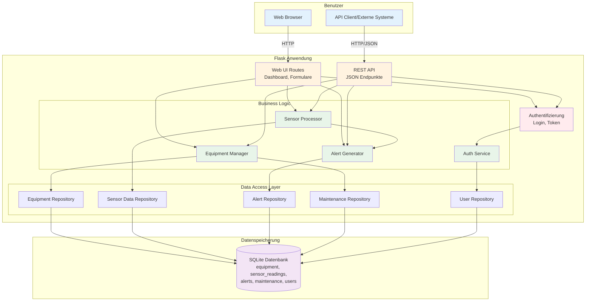
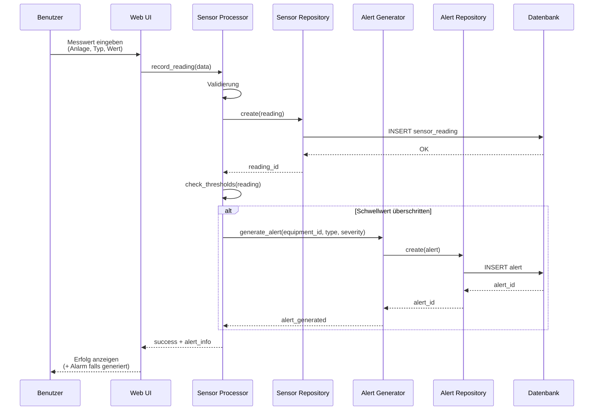

# Hörmann Entwicklertag - Developer Workstream [L200-300]

**Dauer**: 2-3 Stunden  
**Ziel**: Vom Pflichtenheft zur belastbaren Software mit AI-gestützter Entwicklung

---

## Ihr Szenario

Sie sind Senior Developer im Digitalisierungsteam bei Hörmann. Ihr wichtigster Industriekunde - **MegaSteel Manufacturing** - benötigt bis Ende der Woche eine vollständige Software-Lösung für ihr **Industrielles Anlagenüberwachungssystem**. Die bisherigen manuellen Prozesse und Excel-Listen zur Anlagenverwaltung sind nicht mehr ausreichend für ihre wachsende Produktionslinie.

**Problem**: Ihr Team-Lead hat Ihnen einen funktionierenden Prototyp hinterlassen, aber: "Da sind noch mehrere **Sicherheitslücken** drin, die **Performance ist nicht optimal**, und wir brauchen **bessere Tests**. Nutzen Sie AI-gestützte Entwicklung, um diese Probleme zu identifizieren und zu beheben!"

**Ihre Mission**: 
- Analysieren Sie die bestehende Anwendung auf Sicherheitsprobleme
- Identifizieren und beheben Sie Performance-Engpässe
- Verbessern Sie die Testabdeckung mit Property-Based Testing
- Containerisieren Sie die Anwendung für moderne Deployment-Praktiken

Der Kunde wartet. Zeit zu zeigen, was moderne AI-gestützte Entwicklung kann!

---

## Systemübersicht

Das **Industrielle Anlagenüberwachungssystem** bietet:

- **Anlagenregistrierung**: Verwaltung von Industrieanlagen (Pumpen, Motoren, Förderbänder, Kompressoren)
- **Sensordatenerfassung**: Aufzeichnung von Messwerten (Temperatur, Druck, Vibration)
- **Alarmverwaltung**: Automatische Alarme bei Schwellwertüberschreitungen
- **Wartungsverfolgung**: Planung und Dokumentation von Wartungsarbeiten
- **Web-Dashboard**: Interaktive Oberfläche zur Systemüberwachung
- **REST API**: JSON-basierte API für externe Systemintegration

### Systemarchitektur



### Datenfluss: Messwert erfassen



---

## Task 0: Entwicklungsumgebung vorbereiten

<details>
<summary><strong>Task 0.1: Projekt klonen und einrichten</strong></summary>

### Aufgabe

1. **Klonen Sie das Repository** (falls noch nicht geschehen)
2. **Öffnen Sie den Projektordner** in Ihrer IDE
3. **Erstellen Sie eine virtuelle Python-Umgebung**:
   ```bash
   # Versuchen Sie zuerst:
   python -m venv venv
   # Falls das nicht funktioniert:
   python3 -m venv venv
   
   # Aktivieren:
   source venv/bin/activate      # Mac/Linux
   venv\Scripts\activate         # Windows
   ```
4. **Installieren Sie die Abhängigkeiten**:
   ```bash
   pip install -r requirements.txt
   # Falls pip nicht funktioniert:
   pip3 install -r requirements.txt
   ```

### Überprüfung

```bash
# Python-Version prüfen (versuchen Sie beide Befehle)
python --version   # Sollte Python 3.8+ anzeigen
python3 --version  # Alternative, falls python nicht funktioniert

# Installierte Pakete prüfen
pip list    # Sollte Flask, Hypothesis, pytest zeigen
pip3 list   # Alternative, falls pip nicht funktioniert
```

**💡 Hinweis**: Auf Windows-Systemen funktioniert meist `python` und `pip`. Auf manchen Systemen (Mac/Linux) müssen Sie `python3` und `pip3` verwenden.

</details>

<details>
<summary><strong>Task 0.2: Anwendung starten</strong></summary>

### Aufgabe

1. **Starten Sie die Anwendung**:
   ```bash
   python app.py
   # Falls das nicht funktioniert:
   python3 app.py
   ```

2. **Öffnen Sie im Browser**: http://localhost:5000

3. **Melden Sie sich an** mit:
   - Benutzername: `admin`
   - Passwort: `admin123`

### Erwartetes Ergebnis

- Dashboard zeigt deutsche Anlagennamen
- Aktive Alarme werden angezeigt
- Navigation funktioniert

**💡 Tipp**: Lassen Sie die Anwendung im Hintergrund laufen während Sie am Code arbeiten.

</details>

<details>
<summary><strong>Task 0.3: Tests ausführen</strong></summary>

### Aufgabe

Führen Sie die bestehenden Tests aus:

```bash
pytest -v
```

### Erwartetes Ergebnis

Alle Tests sollten erfolgreich durchlaufen (grün).

**💡 Hinweis**: Diese Tests verwenden Property-Based Testing mit Hypothesis - eine moderne Testmethode, die automatisch viele Testfälle generiert.

</details>

---

## Phase 1: Warm-up - System verstehen mit AI (15 Minuten)

### Lernziel

Machen Sie sich mit der Anwendung vertraut und lernen Sie, wie AI-Assistenten Ihnen helfen können, Code schnell zu verstehen.

<details>
<summary><strong>Task 1.1: Anwendung erkunden</strong></summary>

### Aufgabe

Öffnen Sie die Anwendung im Browser (http://localhost:5000) und erkunden Sie alle Seiten:

1. **Dashboard** - Übersicht aller Anlagen mit Gauge-Charts
2. **Anlage hinzufügen** - Formular zur Registrierung neuer Anlagen
3. **Messwert erfassen** - Sensordaten aufzeichnen
4. **Wartung** - Wartungsaufzeichnungen und überfällige Wartungen
5. **Alarme** - Aktive und bestätigte Alarme
6. **Anmelden** - Authentifizierung

### Erwartetes Ergebnis

Sie haben einen Überblick über alle Funktionen der Anwendung.

</details>

<details>
<summary><strong>Task 1.2: AI-Assistent nutzen - Code-Erklärungen</strong></summary>

### Aufgabe

Nutzen Sie Ihren AI-Assistenten (Q Developer, Copilot, etc.), um die Anwendungsstruktur zu verstehen.

**Fragen Sie Ihren AI-Assistenten:**

1. **Über die Hauptseiten:**
   - "Erkläre in 1-2 Sätzen, was die Dashboard-Seite macht"
   - "Was ist der Zweck der Wartungsseite?"
   - "Wie funktioniert die Alarmgenerierung?"

2. **Über die Architektur:**
   - "Öffne `app.py` - Was macht diese Datei?"
   - "Erkläre die Struktur des `repositories/` Ordners"
   - "Was ist der Unterschied zwischen Services und Repositories?"

3. **Über spezifische Komponenten:**
   - "Öffne `routes/web.py` - Welche Routen gibt es?"
   - "Was macht die Klasse `SensorProcessor` in `services/sensor_processor.py`?"
   - "Erkläre die Datenbank-Tabellen in `schema.sql`"

### Beispiel-Prompts

```
"Analysiere die Datei routes/web.py und erkläre mir in 2-3 Sätzen, 
welche Hauptfunktionen diese Routen bereitstellen."
```

```
"Schaue dir services/alert_generator.py an und erkläre, 
wann und wie Alarme generiert werden."
```

```
"Öffne templates/dashboard.html und beschreibe, 
welche Informationen auf dem Dashboard angezeigt werden."
```

### Erwartetes Ergebnis

Sie verstehen:
- Die Hauptkomponenten der Anwendung
- Wie die verschiedenen Layer (Routes → Services → Repositories → Database) zusammenarbeiten
- Welche Funktionalität jede Seite bietet

**💡 Tipp**: Nutzen Sie AI nicht nur zum Code schreiben, sondern auch zum Code verstehen! Das spart Zeit und hilft beim Onboarding.

</details>

<details>
<summary><strong>Task 1.3: Projektstruktur verstehen</strong></summary>

### Aufgabe

Lassen Sie sich von Ihrem AI-Assistenten die Projektstruktur erklären.

**Fragen Sie:**
- "Erkläre mir die Ordnerstruktur dieses Projekts"
- "Welche Dateien sind für die Web-UI verantwortlich?"
- "Wo finde ich die Datenbank-Logik?"
- "Welche Test-Dateien gibt es und was testen sie?"

### Erwartetes Ergebnis

Sie wissen, wo Sie welchen Code finden:
- **`app.py`** - Haupteinstiegspunkt
- **`routes/`** - Web UI und API Endpunkte
- **`services/`** - Business-Logik
- **`repositories/`** - Datenbankzugriff
- **`templates/`** - HTML-Templates
- **`test_*.py`** - Property-Based Tests

</details>

---

## Phase 2: Code-Review und Sicherheitsanalyse (30 Minuten)

### Lernziel

Nutzen Sie AI-Tools, um Sicherheitslücken in bestehendem Code zu identifizieren.

<details>
<summary><strong>Task 2.1: Codebase-Analyse</strong></summary>

### Aufgabe

Nutzen Sie Ihren AI-Assistenten für eine erste Analyse:

**Fragen Sie**:
- "Analysiere die Datei `repositories/equipment.py` auf Sicherheitsprobleme"
- "Finde SQL-Injection-Schwachstellen in diesem Projekt"
- "Überprüfe `config.py` auf hardcodierte Secrets"

### Erwartetes Ergebnis

Der AI-Assistent sollte mindestens diese Probleme identifizieren:
1. SQL-Injection in der `search()` Methode
2. Hardcodierte Secrets in der Konfiguration
3. Fehlende Authentifizierung bei sensiblen Endpunkten

**💡 Tipp**: Öffnen Sie `SECURITY_ISSUES.md` für detaillierte Hinweise zu den Schwachstellen.

</details>

<details>
<summary><strong>Task 2.2: SQL-Injection beheben</strong></summary>

### Aufgabe

**Problem**: Die `search()` Methode in `repositories/equipment.py` ist anfällig für SQL-Injection.

**Fragen Sie Ihren AI-Assistenten**:
- "Wie behebe ich die SQL-Injection-Schwachstelle in dieser Methode?"
- "Zeige mir, wie ich parametrisierte Queries verwende"

### Implementierung

1. Öffnen Sie `repositories/equipment.py`
2. Finden Sie die `search()` Methode
3. Ersetzen Sie String-Konkatenation durch parametrisierte Queries
4. Testen Sie die Änderung

### Überprüfung

```bash
# Dieser Test sollte weiterhin funktionieren
pytest test_equipment_properties.py -v
```

**Vorher** (unsicher):
```python
sql = f"SELECT * FROM equipment WHERE name LIKE '%{query}%'"
```

**Nachher** (sicher):
```python
sql = "SELECT * FROM equipment WHERE name LIKE ?"
params = (f'%{query}%',)
```

</details>

<details>
<summary><strong>Task 2.3: Hardcodierte Secrets entfernen</strong></summary>

### Aufgabe

**Problem**: `config.py` enthält hardcodierte Secrets.

**Fragen Sie Ihren AI-Assistenten**:
- "Wie verschiebe ich hardcodierte Secrets in Umgebungsvariablen?"
- "Zeige mir, wie ich python-dotenv verwende"

### Implementierung

1. Erstellen Sie eine `.env` Datei (und fügen Sie sie zu `.gitignore` hinzu!)
2. Verschieben Sie Secrets aus `config.py` in die `.env` Datei
3. Laden Sie Secrets aus Umgebungsvariablen

### Überprüfung

```bash
grep -r "hardcoded-secret" .  # Sollte nichts finden
```

</details>

---

## Phase 3: Performance-Optimierung (45 Minuten)

### Lernziel

Identifizieren und beheben Sie Performance-Engpässe mit AI-Unterstützung.


<details>
<summary><strong>Task 2.1: N+1 Query Problem identifizieren</strong></summary>

### Aufgabe

**Problem**: Das Dashboard lädt Sensordaten ineffizient.

**Fragen Sie Ihren AI-Assistenten**:
- "Analysiere `repositories/sensor_data.py` auf N+1 Query Probleme"
- "Wie kann ich die `get_latest_readings()` Methode optimieren?"

### Analyse

1. Öffnen Sie `repositories/sensor_data.py`
2. Untersuchen Sie die `get_latest_readings()` Methode
3. Zählen Sie, wie viele Datenbankabfragen für 10 Anlagen ausgeführt werden

### Erwartetes Ergebnis

Sie sollten feststellen: Bei 10 Anlagen werden 11 Queries ausgeführt (1 + 10).

**💡 Tipp**: Siehe `PERFORMANCE_ISSUES.md` für detaillierte Erklärungen.

</details>

<details>
<summary><strong>Task 2.2: N+1 Query Problem beheben</strong></summary>

### Aufgabe

**Fragen Sie Ihren AI-Assistenten**:
- "Schreibe die Methode um, um alle Daten mit einem JOIN zu laden"
- "Zeige mir, wie ich Window Functions in SQLite verwende"

### Implementierung

1. Ersetzen Sie die Schleife durch eine einzelne SQL-Abfrage mit JOIN
2. Verwenden Sie `ROW_NUMBER()` Window Function für die neuesten Messwerte
3. Testen Sie die Performance-Verbesserung

### Überprüfung

```python
# Messen Sie die Ausführungszeit
import time
start = time.time()
readings = sensor_repo.get_latest_readings()
print(f"Zeit: {time.time() - start:.3f}s")
```

**Erwartete Verbesserung**: 5-10x schneller!

</details>

<details>
<summary><strong>Task 2.3: Datenbank-Indizes hinzufügen</strong></summary>

### Aufgabe

**Problem**: Die `sensor_readings` Tabelle hat keine Indizes auf häufig abgefragten Spalten.

**Fragen Sie Ihren AI-Assistenten**:
- "Welche Indizes sollte ich für die sensor_readings Tabelle erstellen?"
- "Wie analysiere ich Query-Performance in SQLite?"

### Implementierung

1. Öffnen Sie `schema.sql`
2. Fügen Sie Indizes für `equipment_id` und `timestamp` hinzu
3. Erstellen Sie einen zusammengesetzten Index für beide Spalten

### SQL-Befehle

```sql
CREATE INDEX idx_sensor_readings_equipment ON sensor_readings(equipment_id);
CREATE INDEX idx_sensor_readings_timestamp ON sensor_readings(timestamp DESC);
CREATE INDEX idx_sensor_readings_equipment_timestamp ON sensor_readings(equipment_id, timestamp DESC);
```

### Überprüfung

```sql
EXPLAIN QUERY PLAN
SELECT * FROM sensor_readings 
WHERE equipment_id = 'PUMPE-001' 
ORDER BY timestamp DESC 
LIMIT 10;
```

Sollte jetzt "SEARCH ... USING INDEX" anzeigen statt "SCAN".

</details>

<details>
<summary><strong>Task 2.4: Ineffiziente Statistik-Berechnung optimieren</strong></summary>

### Aufgabe

**Problem**: `services/sensor_processor.py` berechnet Statistiken in mehreren Durchläufen.

**Fragen Sie Ihren AI-Assistenten**:
- "Optimiere diese Statistik-Berechnung auf einen einzigen Durchlauf"
- "Wie berechne ich Min, Max, Durchschnitt und Standardabweichung effizient?"

### Implementierung

1. Öffnen Sie `services/sensor_processor.py`
2. Finden Sie die `calculate_statistics()` Methode
3. Kombinieren Sie alle Berechnungen in einer Schleife

### Erwartetes Ergebnis

**Vorher**: 5 Durchläufe über die Daten  
**Nachher**: 1 Durchlauf über die Daten  
**Speedup**: 5-6x schneller

</details>

---

## Phase 4: Property-Based Testing (45 Minuten)

### Lernziel

Verstehen und erweitern Sie Property-Based Tests mit Hypothesis.

<details>
<summary><strong>Task 3.1: Property-Based Testing verstehen</strong></summary>

### Aufgabe

**Fragen Sie Ihren AI-Assistenten**:
- "Was ist Property-Based Testing und wie unterscheidet es sich von Unit-Tests?"
- "Erkläre mir, wie Hypothesis funktioniert"
- "Zeige mir Beispiele für gute Properties in diesem Projekt"

### Analyse

1. Öffnen Sie `test_equipment_properties.py`
2. Untersuchen Sie die bestehenden Property-Tests
3. Verstehen Sie, wie `@given` Dekoratoren funktionieren

### Erwartetes Ergebnis

Sie verstehen:
- Properties sind universelle Regeln, die für alle Eingaben gelten
- Hypothesis generiert automatisch Testfälle
- Tests validieren Korrektheit über viele Szenarien

</details>

<details>
<summary><strong>Task 3.2: Neue Property-Tests schreiben</strong></summary>

### Aufgabe

Schreiben Sie einen neuen Property-Test für die Alarmgenerierung.

**Fragen Sie Ihren AI-Assistenten**:
- "Schreibe einen Property-Test, der prüft, dass Alarme bei Schwellwertüberschreitung generiert werden"
- "Wie erstelle ich einen Hypothesis-Generator für Sensordaten?"

### Implementierung

Erstellen Sie einen Test in `test_alert_properties.py`:

```python
from hypothesis import given, strategies as st

@given(
    sensor_value=st.floats(min_value=0, max_value=200),
    threshold=st.floats(min_value=50, max_value=100)
)
def test_threshold_alert_generation(sensor_value, threshold):
    # Property: Wenn Wert > Schwellwert, dann Alarm
    if sensor_value > threshold:
        alert = generate_alert(sensor_value, threshold)
        assert alert is not None
    else:
        alert = generate_alert(sensor_value, threshold)
        assert alert is None
```

### Überprüfung

```bash
pytest test_alert_properties.py -v
```

</details>

<details>
<summary><strong>Task 3.3: Round-Trip Property testen</strong></summary>

### Aufgabe

Round-Trip Properties sind besonders wertvoll für Serialisierung/Deserialisierung.

**Fragen Sie Ihren AI-Assistenten**:
- "Schreibe einen Round-Trip Test für Equipment-Daten"
- "Was ist ein Round-Trip Property und warum ist es wichtig?"

### Konzept

```python
# Property: Speichern → Laden → Sollte identisch sein
@given(equipment=equipment_strategy())
def test_equipment_roundtrip(equipment):
    # Speichern
    repo.create(equipment)
    
    # Laden
    loaded = repo.get_by_id(equipment['equipment_id'])
    
    # Vergleichen
    assert loaded['name'] == equipment['name']
    assert loaded['type'] == equipment['type']
```

</details>

---

## Phase 5: Containerisierung (30 Minuten)

### Lernziel

Containerisieren Sie die Anwendung für moderne Deployment-Praktiken.

<details>
<summary><strong>Task 4.1: Dockerfile erstellen</strong></summary>

### Aufgabe

**Fragen Sie Ihren AI-Assistenten**:
- "Erstelle ein Dockerfile für diese Flask-Anwendung"
- "Was sind Best Practices für Python-Container?"

### Implementierung

Erstellen Sie `Dockerfile`:

```dockerfile
FROM python:3.11-slim

WORKDIR /app

COPY requirements.txt .
RUN pip install --no-cache-dir -r requirements.txt

COPY . .

EXPOSE 5000

CMD ["python", "app.py"]
```

### Überprüfung

```bash
docker build -t industrial-monitoring .
docker run -p 5000:5000 industrial-monitoring
```

</details>

<details>
<summary><strong>Task 4.2: Docker Compose konfigurieren</strong></summary>

### Aufgabe

**Fragen Sie Ihren AI-Assistenten**:
- "Erstelle eine docker-compose.yml für diese Anwendung"
- "Wie konfiguriere ich Volume-Mounts für die Datenbank?"

### Implementierung

Erstellen Sie `docker-compose.yml`:

```yaml
version: '3.8'

services:
  app:
    build: .
    ports:
      - "5000:5000"
    volumes:
      - ./industrial_monitoring.db:/app/industrial_monitoring.db
    environment:
      - SECRET_KEY=${SECRET_KEY}
      - DATABASE_PATH=/app/industrial_monitoring.db
```

### Überprüfung

```bash
docker-compose up
```

</details>

<details>
<summary><strong>Task 4.3: .dockerignore erstellen</strong></summary>

### Aufgabe

**Fragen Sie Ihren AI-Assistenten**:
- "Was sollte in .dockerignore für ein Python-Projekt stehen?"

### Implementierung

Erstellen Sie `.dockerignore`:

```
__pycache__
*.pyc
*.pyo
*.pyd
.Python
venv/
.venv/
.pytest_cache/
.hypothesis/
*.db
.git/
.gitignore
README.md
```

</details>

---

## Bonus-Aufgaben (Optional)

<details>
<summary><strong>Bonus 1: API-Paginierung implementieren</strong></summary>

### Aufgabe

Fügen Sie Paginierung zu den Sensor-Endpunkten hinzu.

**Fragen Sie Ihren AI-Assistenten**:
- "Implementiere Paginierung für den /api/sensors/readings Endpunkt"
- "Was sind Best Practices für REST API Paginierung?"

### Erwartetes Ergebnis

```bash
curl "http://localhost:5000/api/sensors/readings?page=1&per_page=50"
```

Sollte paginierte Ergebnisse mit Metadaten zurückgeben.

</details>

<details>
<summary><strong>Bonus 2: Passwort-Hashing implementieren</strong></summary>

### Aufgabe

Ersetzen Sie Klartext-Passwörter durch gehashte Passwörter.

**Fragen Sie Ihren AI-Assistenten**:
- "Implementiere sicheres Passwort-Hashing mit werkzeug.security"
- "Wie migriere ich bestehende Klartext-Passwörter?"

### Implementierung

Verwenden Sie `werkzeug.security`:
- `generate_password_hash()` beim Erstellen
- `check_password_hash()` beim Authentifizieren

</details>

<details>
<summary><strong>Bonus 3: Token-Expiration hinzufügen</strong></summary>

### Aufgabe

Implementieren Sie Token-Ablauf für Authentifizierung.

**Fragen Sie Ihren AI-Assistenten**:
- "Implementiere JWT-Tokens mit Ablaufzeit"
- "Wie validiere ich abgelaufene Tokens?"

</details>

---

## Zusammenfassung und Reflexion

### Was Sie gelernt haben

✅ **Sicherheit**:
- SQL-Injection-Schwachstellen identifizieren und beheben
- Secrets aus Code in Umgebungsvariablen verschieben
- Authentifizierung für sensible Endpunkte implementieren

✅ **Performance**:
- N+1 Query Probleme erkennen und lösen
- Datenbank-Indizes strategisch einsetzen
- Algorithmen für Single-Pass-Verarbeitung optimieren

✅ **Testing**:
- Property-Based Testing mit Hypothesis verstehen
- Universelle Properties definieren und testen
- Round-Trip Properties für Datenintegrität nutzen

✅ **DevOps**:
- Anwendungen containerisieren mit Docker
- Multi-Container-Setups mit Docker Compose
- Best Practices für Container-Images

### Diskussionsfragen

1. **Wie hat AI-Unterstützung Ihren Entwicklungsprozess verändert?**
2. **Welche Sicherheitsprobleme waren am schwierigsten zu finden?**
3. **Wie würden Sie Property-Based Testing in Ihren Projekten einsetzen?**
4. **Was sind die nächsten Schritte für Production-Deployment?**

---

## Ressourcen

### Dokumentation
- `README.md` - Projektübersicht und API-Dokumentation
- `SECURITY_ISSUES.md` - Detaillierte Sicherheitsprobleme und Lösungen
- `PERFORMANCE_ISSUES.md` - Performance-Optimierungen mit Beispielen

### Weiterführende Links
- [OWASP Top 10](https://owasp.org/www-project-top-ten/)
- [Hypothesis Documentation](https://hypothesis.readthedocs.io/)
- [Flask Security Best Practices](https://flask.palletsprojects.com/en/3.0.x/security/)
- [Docker Best Practices](https://docs.docker.com/develop/dev-best-practices/)

---

## Nächste Schritte

Nach dem Workshop können Sie:

1. **Weitere Sicherheitsprobleme beheben** (siehe SECURITY_ISSUES.md)
2. **Zusätzliche Performance-Optimierungen** implementieren
3. **Test-Coverage erweitern** mit mehr Property-Tests
4. **CI/CD Pipeline** einrichten für automatisierte Tests
5. **Monitoring und Logging** hinzufügen für Production

**Viel Erfolg beim Workshop! 🚀**
